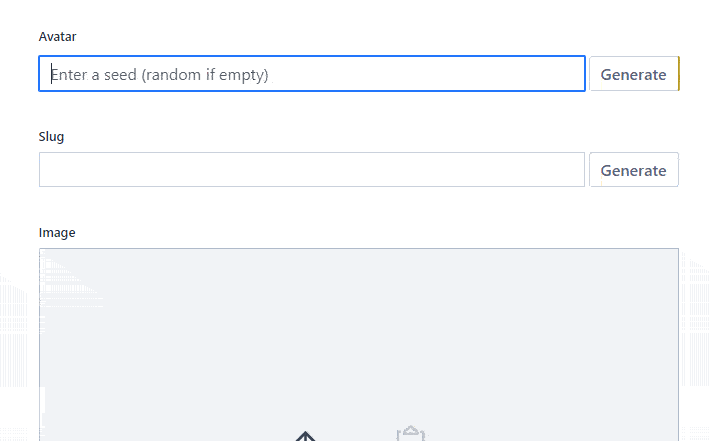

# Create a custom Sanity.io input for DiceBear avatars

In this tutorial, we will build a custom input widget fot Sanity studio. The input will be calling an external api to fetch an avatar image. It is inspired by my previous tinkering with a custom input for fetching tweets from the twitter api.

The source we'll be using to get our avatar is [DiceBear Avatars](https://avatars.dicebear.com/) api.

## Prerequisites

Amongst the general knowledge of React, I highly recommend to check those two official tutorials for custom widget creation:

- https://www.sanity.io/guides/how-to-make-a-custom-input-component

- https://www.sanity.io/docs/custom-input-widgets

**Why should I read this tutorial when I can read the official ones?**

Great question! There are two main topics the official tutorials don't cover:

- create a custom input as functional component (both official tutorials use class components),
- get the value from an external api using user input as argument in the api call.

## The Schema

First, we need to create a schema for our data structure. In the schema folder, create a file named avatar.js. It will be quite simple schema: it needs only two fields, `seed` and `markup`. Both will be of type string – we will store the received avatar string in that serialized format. Because the value of `markup` field will be derived from the `seed` value, we don't want to access it directly – hence the `hidden` prop.

```javascript
// avatar.js
export default {
  title: "Avatar",
  name: "avatar",
  type: "object",
  fields: [
    {
      name: "seed",
      title: "Seed",
      type: "string",
    },
    {
      name: "markup",
      type: "string",
      hidden: true,
    },
  ],
}
```

Then we will import our schema in the default one (pass it in the `createSchema` function):

```javascript
// schema.js
import createSchema from "part:@sanity/base/schema-creator"
import schemaTypes from "all:part:@sanity/base/schema-type"

import blockContent from "./blockContent"
import category from "./category"
import post from "./post"
import author from "./author"
import avatar from "./avatar"

export default createSchema({
  name: "default",
  types: schemaTypes.concat([post, author, category, blockContent, avatar]),
})
```

We will use the input in the "author" document (you can pick any other that suits your needs):

```javascript
// author.js
export default {
  name: "author",
  title: "Author",
  type: "document",
  fields: [
    {
      name: "name",
      title: "Name",
      type: "string",
    },
    {
      name: "avatar",
      title: "Avatar",
      type: "avatar",
    },
    {
      name: "slug",
      title: "Slug",
      type: "slug",
      options: {
        source: "name",
        maxLength: 96,
      },
	  // other fields…
  ],
}
```

## The Input

Now it is the time to create our custom input. Let's create a folder named `inputs` and in that folder, create a file named `AvatarInput.js`.

The file below will serve as a boilerplate. We will import bunch of React methods (including a few rather exotic ones), `TextInput` from the brand new `@sanity/ui` library and `FormField` from `@sanity/components`. Everything we will be using should be already installed during the initial Sanity init, but if you encounter any issue with missing dependencies, you can install them manually.

One important quote from the official docs:

> Given the props
>
> - `value` - the current value or undefined if no value is present
> - `onChange` - a function to call when the value should be updated
>
> It must:
>
> - Present an interface that allows editing `props.value`, e.g. through an `<input ...>` element
> - Call `props.onChange` with a patch describing the operation that should be applied on the value
> - Implement a `.focus()` method, that sets focus on the underlying dom node that represents the input.

Note the quite essential `{ onChange, type, value } = props`: these are props coming from Sanity. The Type prop is describing the shape of our partial schema. The value prop is an object containing current values of the fields (if there are any). The `onChange` prop is a function that is responsible for propagating the change of input value into our dataset. Note that its name can be a little confusing: There will be two functions of that same name, the one coming from the aforementioned props, the second which is the event handler of the text input (there will be no collision due to different lexical scopes).

If you've taken a look at the official tutorials, you've seen them using React class components. Because I don't like class components much (sorry), I will use a functional one. Also, showing how to use a functional component as Sanity input might be one of the rationales fot this post.

There is a little drawback regarding functional components as Sanity input widgets. When using class component, it is sufficient to add a `focus()` method, but with a functional one, we need to wrap the component in a `forwardRef` call and to invoke `useImperativeHandle` hook inside of it (with an object containing focus method as argument). It might be a little heavy-handed, but I would still go for it.

The two `useState` hooks will be used to update our UI as the input value change (not implemented yet).

```javascript
// AvatarInput.js
import React, { useRef, useState, forwardRef, useImperativeHandle } from "react"

import { TextInput } from "@sanity/ui"
import FormField from "part:@sanity/components/formfields/default"

const AvatarInput = forwardRef((props, ref) => {
  // Props coming from Sanity studio:
  const { onChange, type, value } = props
  // lets pick the values from props and use them to populate our state.
  // The state will then be used to update the UI.
  const initialSeed = value && value.seed ? value.seed : ""
  const initialMarkup = value && value.markup ? value.markup : ""

  const [seed, setSeed] = useState(initialSeed)
  const [markup, setMarkup] = useState(initialMarkup)

  // inputRef and useImperativeHandle are used by Sanity studio.
  const inputRef = useRef()

  useImperativeHandle(ref, () => ({
    focus: () => inputRef.current.focus(),
  }))

  return (
    <FormField label={type.title}>
      <TextInput
        ref={inputRef}
        onChange={() => {}} // left empty for now
        placeholder="Enter a seed (random if empty)"
        type="text"
        value={seed}
      />
    </FormField>
  )
})

export default AvatarInput
```

We'll have to import our newly created custom input component (which is not doing anything yet) in our avatar schema:

```javascript
// avatar.js
import AvatarInput from "../inputs/AvatarInput" //

export default {
  title: "Avatar",
  name: "avatar",
  inputComponent: AvatarInput, //
  type: "object",
  fields: [
    {
      name: "seed",
      title: "Seed",
      type: "string",
    },
    {
      name: "markup",
      type: "string",
      hidden: true,
    },
  ],
}
```

All right! Now let's make the input working. We'll implement the functionality to trigger a request to the DiceBear Avatar api whenever the seed changes:

```javascript
//AvatarInput.js
import React, { useRef, useState, forwardRef, useImperativeHandle } from "react"

import { TextInput } from "@sanity/ui"
import FormField from "part:@sanity/components/formfields/default"

const AvatarInput = forwardRef((props, ref) => {
  const { onChange, type, value } = props

  const initialSeed = value && value.seed ? value.seed : ""
  const initialMarkup = value && value.markup ? value.markup : ""

  const [seed, setSeed] = useState(initialSeed)
  const [markup, setMarkup] = useState(initialMarkup)

  const inputRef = useRef()

  useImperativeHandle(ref, () => ({
    focus: () => inputRef.current.focus(),
  }))

  // onChange handler is setting a state which is updating our UI and is triggering an api request:
  const handleChange = updatedSeed => {
    setSeed(updatedSeed)
    getAvatar(updatedSeed)
  }

  // The actual request. We are hitting the "https://avatars.dicebear.com" api endpoint which should send a response containing a svg avatar in its body.
  const getAvatar = async seed => {
    try {
      const response = await fetch(`https://avatars.dicebear.com/4.5/api/human/${seed}.svg`)
      // The svg avatar is a string, which is being read as text, not a JSON
      const avatarString = await response.text()

      // using our state with the received avatar string
      setMarkup(avatarString), console.log("avatar: ", avatarString)
    } catch (error) {
      console.log(error)
    }
  }

  return (
    <FormField label={type.title}>
      <TextInput
        ref={inputRef}
        onChange={event => {
          handleChange(event.target.value)
        }}
        placeholder="Enter a seed (random if empty)"
        type="text"
        value={seed}
      />
    </FormField>
  )
})

export default AvatarInput
```

If we type something in our text input, we should receive a response which contains a svg avatar string in its body. If we open our console, we should be able to see it:

But we don't want just some silly text in the console. We want to see the actual avatar! Lets update our our UI widget to make it possible.

I am using Styled components to style the preview (styled-components is a peer dependency of @sanity/ui, so it should be already installed).

```javascript
//AvatarInput.js
import React, { useRef, useState, forwardRef, useImperativeHandle } from "react"

import { TextInput } from "@sanity/ui"
import FormField from "part:@sanity/components/formfields/default"
import styled from "styled-components"

// These styles will make our widget really neat:
const AvatarPreview = styled.div`
  padding: 2rem
  display: flex
  align-items: center
  justify-content: center
  & > img {
    width: 6rem
    border-radius: 6px
    box-shadow: 0 0 0 1px hsl(0deg 0% 85%), 0 0 0 4px hsl(0deg 0% 90%),
      0 0 0 5px hsl(0deg 0% 80%), 0px 5px 10px hsl(0deg 0% 40%)
  }
`

const AvatarInput = forwardRef((props, ref) => {
  const { onChange, type, value } = props

  const initialSeed = value && value.seed ? value.seed : ""
  const initialMarkup = value && value.markup ? value.markup : ""

  const [seed, setSeed] = useState(initialSeed)
  const [markup, setMarkup] = useState(initialMarkup)

  const inputRef = useRef()

  useImperativeHandle(ref, () => ({
    focus: () => inputRef.current.focus(),
  }))

  const handleChange = updatedSeed => {
    setSeed(updatedSeed)
    getAvatar(updatedSeed)
  }

  const getAvatar = async seed => {
    try {
      const response = await fetch(`https://avatars.dicebear.com/4.5/api/human/${seed}.svg`)
      const avatarString = await response.text()

      setMarkup(avatarString), console.log("avatar: ", avatarString)
    } catch (error) {
      console.log(error)
    }
  }

  return (
    <FormField label={type.title}>
      <TextInput
        ref={inputRef}
        onChange={event => {
          handleChange(event.target.value)
        }}
        placeholder="Enter a seed (random if empty)"
        type="text"
        value={seed}
      />
      {markup && (
        <AvatarPreview>
          
        </AvatarPreview>
      )}
    </FormField>
  )
})

export default AvatarInput
```

Note: while it is always a good idea to regard security and sanitize user input (including public apis), svgs included in an `` tag are not allowed to reach for external sources, nor to execute scripts.

Splendid! So right now, we can fetch an avatar and see it in our UI widget. But… we are not actually saving it to our dataset. Let's implement that!

```javascript
//AvatarInput.js
import React, { useRef, useState, forwardRef, useImperativeHandle } from "react"
import PatchEvent, { set, setIfMissing } from "part:@sanity/form-builder/patch-event"
import { TextInput } from "@sanity/ui"
import FormField from "part:@sanity/components/formfields/default"
import styled from "styled-components"

const AvatarPreview = styled.div`
  padding: 2rem
  display: flex
  align-items: center
  justify-content: center
  & > img {
    width: 6rem
    border-radius: 6px
    box-shadow: 0 0 0 1px hsl(0deg 0% 85%), 0 0 0 4px hsl(0deg 0% 90%),
      0 0 0 5px hsl(0deg 0% 80%), 0px 5px 10px hsl(0deg 0% 40%)
  }
`

const AvatarInput = forwardRef((props, ref) => {
  const { onChange, type, value } = props

  const initialSeed = value && value.seed ? value.seed : ""
  const initialMarkup = value && value.markup ? value.markup : ""

  const [seed, setSeed] = useState(initialSeed)
  const [markup, setMarkup] = useState(initialMarkup)

  const inputRef = useRef()

  useImperativeHandle(ref, () => ({
    focus: () => inputRef.current.focus(),
  }))

  const handleChange = updatedSeed => {
    setSeed(updatedSeed)
    getAvatar(updatedSeed)
  }

  const getAvatar = async seed => {
    try {
      const response = await fetch(`https://avatars.dicebear.com/4.5/api/human/${seed}.svg`)
      const avatarString = await response.text()

      setMarkup(avatarString), console.log("avatar: ", avatarString)

      // saving the avatar to our dataset
      onChange(
        PatchEvent.from([
          setIfMissing({ _type: type.name }),
          set(avatarString, ["markup"]),
          set(seed, ["seed"]),
        ]),
      )
    } catch (error) {
      console.log(error)
    }
  }

  return (
    <FormField label={type.title}>
      <TextInput
        ref={inputRef}
        onChange={event => {
          handleChange(event.target.value)
        }}
        placeholder="Enter a seed (random if empty)"
        type="text"
        value={seed}
      />
      {avatar && (
        <AvatarPreview>
          
        </AvatarPreview>
      )}
    </FormField>
  )
})

export default AvatarInput
```

Good job! our avatar should now be saved when the request succeeds (you can check it by leaving the document and coming back again). So… is it ready now? Unfortunately, not. We are saving our desired avatar, which is great – but currently there is no way to get rid of it. The usual way how to tell Sanity that we want to delete some value is to clear its input, it doesn't work here. The avatar value is being derived from the seeds input value. The seeds input value is being used as the "seed" parameter for the query to DiceBear Avatar api, and it is considered "random" when its empty. Thus, when we clear the input, instead od deleting the avatar, we'll receive a random one.

O.K., but what can we do about it?

Well, it would be probably the best idea to implement the default Sanity dealing with empty inputs (deleting the value) and make ourself responsible for creating random seeds. While it would be probably a better idea to install a library for random seeds generation (like uuid), I will implement a simple custom one (which means a one-liner copied from github, to be honest).

We will need to change our component a little, because we will add a button. The button, when being click, will generate a new seed (and therefore trigger a request for new avatar):

```javascript
import React, { useRef, useState, forwardRef, useImperativeHandle } from "react"
import PatchEvent, { set, unset, setIfMissing } from "part:@sanity/form-builder/patch-event"
import { TextInput, Button, Flex, Box } from "@sanity/ui"
import FormField from "part:@sanity/components/formfields/default"
import styled from "styled-components"

const AvatarPreview = styled.div`
  padding: 2rem
  display: flex
  align-items: center
  justify-content: center
  & > img {
    width: 6rem
    border-radius: 6px
    box-shadow: 0 0 0 1px hsl(0deg 0% 85%), 0 0 0 4px hsl(0deg 0% 90%),
      0 0 0 5px hsl(0deg 0% 80%), 0px 5px 10px hsl(0deg 0% 40%)
  }
`

const AvatarInput = forwardRef((props, ref) => {
  const { onChange, type, value } = props

  const initialSeed = value && value.seed ? value.seed : ""
  const initialMarkup = value && value.markup ? value.markup : ""

  const [seed, setSeed] = useState(initialSeed)
  const [markup, setMarkup] = useState(initialMarkup)

  const inputRef = useRef()

  useImperativeHandle(ref, () => ({
    focus: () => inputRef.current.focus(),
  }))

  // our custom uuid function
  const generateRandomString = () =>
    Math.random().toString(36).substring(2, 15) + Math.random().toString(36).substring(2, 15)

  const handleChange = updatedSeed => {
    setSeed(updatedSeed)
    // When the input was cleared, remove the avatar
    if (updatedSeed === "") {
      removeAvatar()
    } else {
      getAvatar(updatedSeed)
    }
  }

  const getAvatar = async seed => {
    try {
      const response = await fetch(`https://avatars.dicebear.com/4.5/api/human/${seed}.svg`)

      const avatarString = await response.text()

      setMarkup(avatarString)

      onChange(
        PatchEvent.from([
          setIfMissing({ _type: type.name }),
          set(avatarString, ["markup"]),
          set(seed, ["seed"]),
        ]),
      )
    } catch (error) {
      console.log(error)
    }
  }

  // This function will unset our current avatar
  const removeAvatar = () => {
    setMarkup("")
    onChange(PatchEvent.from([unset(["markup", "seed"])]))
  }

  // Let's change our returned markup a bit
  return (
    <FormField label={type.title}>
      <Flex>
        <Box flex={1}>
          <TextInput
            ref={inputRef}
            onChange={event => {
              handleChange(event.target.value)
            }}
            placeholder="Enter a seed (random if empty)"
            type="text"
            value={seed}
          />
        </Box>
        <Box marginLeft={1}>
          <Button
            text="Generate"
            mode="ghost"
            onClick={() => handleChange(generateRandomString())}
          />
        </Box>
      </Flex>
      {markup && (
        <AvatarPreview>
          
        </AvatarPreview>
      )}
    </FormField>
  )
})

export default AvatarInput
```

Now, it should be working fine, as shown in the animation beneath:



## Conclusion

There are still things that should probably be added, e. g.:

- `propTypes` definitions,
- actual error handling of the fetch request (currently just logging errors to console),
- debounce on the inputs `onChange` handler to prevent unnecessary fetch requests.

But I sense that the resulting code has an rather scary length already, so I'll just left it that way. Feel free to go further if you'd feel like.

I hope this post helps you to get a firmer grasp on the vast array of possibilities of customization that is Sanity.io offering.

👍 Enjoy!
