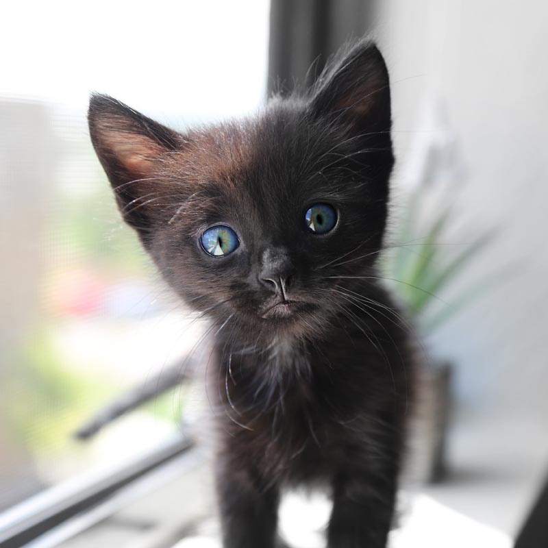

import YouTube from "mdx-embed"

# Circular reveal animation: simple & dirty way

<YouTube youTubeId="YdvQPkJd0gc" />

[Creating a circular reveal animation with JavaScript and CSS!](https://www.youtube.com/watch?v=YdvQPkJd0gc)

https://web.dev/animations-guide/

https://www.smashingmagazine.com/2016/12/gpu-animation-doing-it-right/


It may seemed a little too complex, but there is a very good reason why doing it that way. As the official notes from Google say, the only two css properties, that we should ever be animating are opacity and transform. That being said, we can by no means animate whatever we want – but we are not given a guarantee of the animation being smooth.

Do it at your own risk!

But while fiddling with the 'render' tab on devtools, adding `will-change: box-shadow` doesn't seem to affect the performance in any way.

```css
:root {
  --dimensions: 200px;
  --bgColor: inherit;
  --cropSize: calc(var(--dimensions) / 10);
}

.container {
  position: relative;
  height: var(--dimensions);
  width: var(--dimensions);
}

.container::after {
  content: "";
  position: absolute;
  top: 0;
  left: 0;
  height: 100%;
  width: 100%;
  border-radius: 50%;
  z-index: 1;
  box-shadow: inset 0 0 0 var(--cropSize) var(--bgColor);
  transition: box-shadow 0.3s ease;
}

.container:hover::after {
  box-shadow: inset 0 0 0 0 white;
}

.image {
  position: absolute;
  inset: 1px;
  max-width: calc(100% - 2px);
  max-height: calc(100% - 2px);
  z-index: -1;
  border-radius: 50%;
}
```

## Demo

  <div id="uncrop-transition-demo">
    <style  dangerouslySetInnerHTML={{
    __html:
      '\n      #uncrop-transition-demo {\n        --dimensions: 240px;\n        --cropColor: var(--bg-primary);\n        --cropSize: calc(var(--dimensions) / 10);\n      }\n\n      .center {\n        display: flex;\n        align-items: center;\n        justify-content: center;\n        }\n\n      .container {\n        position: relative;\n        height: var(--dimensions);\n        width: var(--dimensions);\n      }\n\n      .container::after {\n        content: "";\n        position: absolute;\n        top: 0;\n        left: 0;\n        height: 100%;\n        width: 100%;\n        border-radius: 50%;\n        z-index: 1;\n        box-shadow: inset 0 0 0 var(--cropSize) var(--cropColor);\n        transition: box-shadow 0.3s ease;\n      }\n\n      .container:hover::after {\n        box-shadow: inset 0 0 0 0 var(--cropColor);\n      }\n\n      .image {\n        position: absolute;\n        inset: 1px;\n        max-width: calc(100% - 2px);\n        max-height: calc(100% - 2px);\n        z-index: -1;\n        border-radius: 50%;\n      }\n    '
  }}
/>
    <div className="center">
      <div className="container">
        
      </div>
    </div>

  </div>
