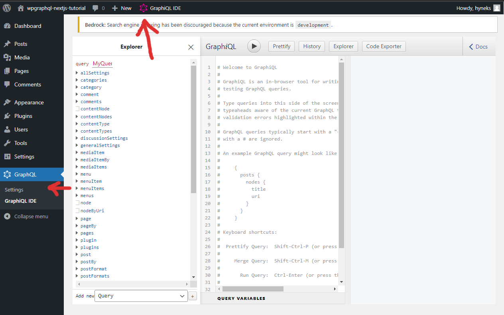
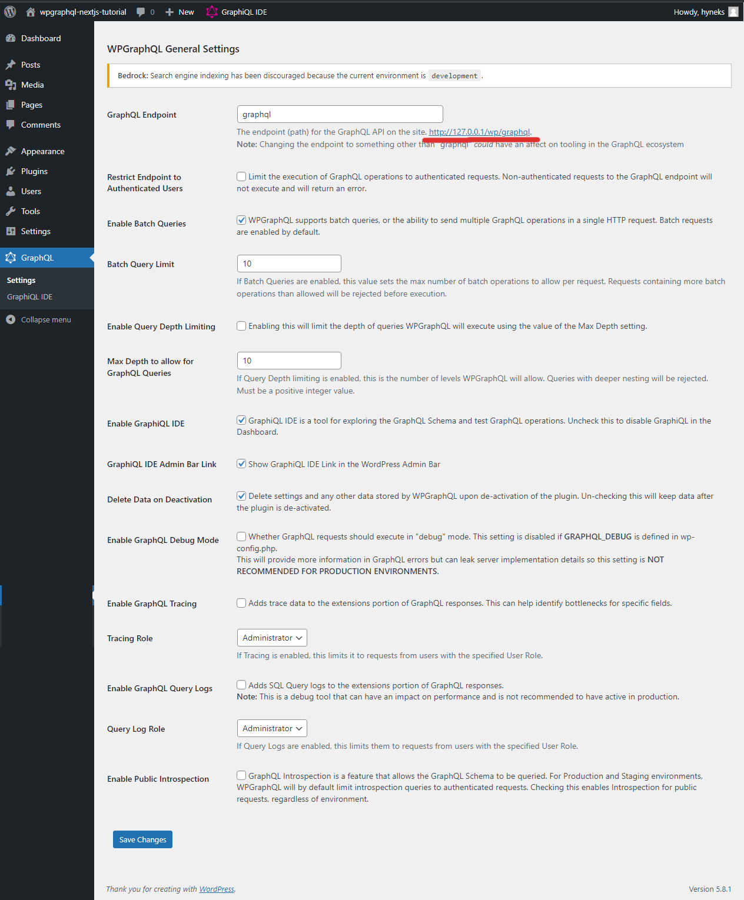

# Create a Next.js static site with Wordpress and GraphQL (WP GraphQL + Next.js, part 1)

In this tutorial, we will create a JAMstack app by connecting three quite different libraries. On the backend, there is the old champ WordPress, tuned up by [Roots](https://roots.io). On the frontend, there is the wonder child, [Next.js](https://nextjs.org). Between those two, there is a great invention from a villain scientists lab, [GraphQL](https://graphql.org).

As it turned out, these three, while being different ages and languages, went along really well! Let's try yourself!

## Prerequisites

This tutorial assumes that we have some experience with both WordPress and React (not necessarily Next.js). It also assumes that we have already installed [Composer](https://getcomposer.org) and that we have some kind of LAMP stack development environment (e. g. [XAMPP](https://www.apachefriends.org/index.html), [Laragon](https://laragon.org/) or [Local](https://localwp.com/)) set up. We will also need either to create a new MySQL database for our WordPress project, or to use an existing one.

On the Next.js part, I will use [yarn](https://github.com/yarnpkg/berry) as a packet manager. While I was a long time satisfied npm user, I switched to yarn because it was able to get around some nasty `node-gyp` issues. But feel free to use whatever packet manager you like (just update the commands accordingly).

## Why Bedrock?

[Bedrock](https://roots.io/bedrock/) is an open source boilerplate for WordPress development. It significantly improves the developer experience and makes WordPress development feel quite up to date. It fully leverages the advantages of Composer by making WordPress and its plugins *modules* that can be easily installed and updated from a command line. It also stores the configuration in a separate `.env` files, which makes the configuration and version control much easier. The folder structure is also improved (user data like uploads are separated). After trying Bedrock, I definitely don't want to go back to the 'out of the box' WordPress.

## Install and Set up New WordPress/Bedrock Project

First, let's create a new Bedrock project:

```bash
composer create-project roots/bedrock
```

In our freshly created project root directory, there is an `.env` file. Unlike the 'vanilla' WordPress release, where the sensitive data are basically 'hardcoded' in the `config.php` file (which brings the problem with version control), Bedrock follows the 'modern' approach where the sensitive data are stored in the environmental variables. Let's open the file and update it with our database credentials. Also, unlike 'vanilla' WordPress, our sites base url is stored here as as `WP_HOME` (which makes switching environments much smoother). Let's update it as well. Last but not least, it is definitely a good practice to generate the cryptographic salts, which are also stored in the `.env` file.

## Install the Plugins

After installing and setting up our project, let's open its root folder and install the **WP GraphQL** plugin, also using Composer. Let's open the `composer.json` file (it's in the root directory) and add `wpackagist-plugin/wp-graphql` to the list of dependencies (under `required`), like that:

```json lines=14
// composer.json

// ...
"require": {
  "php": ">=7.1",
  "composer/installers": "^1.12",
  "vlucas/phpdotenv": "^5.3",
  "oscarotero/env": "^2.1",
  "roots/bedrock-autoloader": "^1.0",
  "roots/bedrock-disallow-indexing": "^2.0",
  "roots/wordpress": "5.8.1",
  "roots/wp-config": "1.0.0",
  "roots/wp-password-bcrypt": "1.0.0",
  "wpackagist-plugin/wp-graphql": "^1.6"
},
// ...
```

After adding WP GraphQL plugin to a list of dependencies in `composer.json`, we have to run the `update` command. Composer will download and install the plugin and all its dependencies:

```bash
composer update
```

Let's test if everything is working fine. Let's start our development environment. We need to point our server to a `web` subdirectory, which is a distinction from 'vanilla' release. The 'admin' urls are also slightly different – they are prefixed by `/wp/` segment, so `https://example.com/wp-login.php` is now `https://example.com/wp/wp-login.php`. This can cause some issues when importing an existing database, and the rewrite rules mismatch. When I encounter that issue, I was able to solve it by creating a `.htaccess` file with the [default rewrite rules](https://wordpress.org/support/article/htaccess/) and saving it to the `web` directory.

Hopefully, everything went well and we successfully installed a new WordPress instance. Let's log in our admin pages and activate the WP GraphQL plugin. A GraphQL link should appear at the sidebar, and a GraphiQL IDE link should appear on the upper bar:



Also, check the plugin settings (see image below). We didn't need to change any of the defaults. Just notice the 'GraphQL Endpoint' option, because we will need this later while querying the from our Next app.



One more thing: Right now, if we use a fresh new install with and empty database, there are barely any data to query (just the default 'Hello World' post), which is kind of dull. Let's create more posts! We'll use the 'Faker Press' plugin.

```json lines=15
// composer.json

// ...
"require": {
  "php": ">=7.1",
  "composer/installers": "^1.12",
  "vlucas/phpdotenv": "^5.3",
  "oscarotero/env": "^2.1",
  "roots/bedrock-autoloader": "^1.0",
  "roots/bedrock-disallow-indexing": "^2.0",
  "roots/wordpress": "5.8.1",
  "roots/wp-config": "1.0.0",
  "roots/wp-password-bcrypt": "1.0.0",
  "wpackagist-plugin/wp-graphql": "^1.6",
  "wpackagist-plugin/fakerpress": "^0.5"
},
// ...
```

And we'll install the plugin the same way as the first one:

```bash
composer update
```

When the plugin is installed and activated, the 'FakerPress' menu item appears on the side bar. Let's go to the 'posts' submenu and create some posts. I did create 12 posts from 'this month', but feel free to change that settings. I would just recommend to create _some_ posts.


## Install Next.js

Now, with WordPress set up, it is time to install Next.js. It really doesn't matter, _where_ we will install it; it can be completely separated from WordPress. For the sake of simplicity, let's install it to the root directory of our project, so it will look like this:

```fs
wordpress-next-app/
  ├── bedrock/
  └── nextjs/
```

I would recommend to already set up a TypeScript project (by using the `--typescript` flag), even though we will use only plain javascript in this tutorial, and all possible TypeScript complaints will be silenced. The actual typing (especially the typing of GraphQL queries) will be the topic of the second part of out tutorial.

```bash
yarn create next-app --typescript
```

## Create a Basic Api

In our Next.js project we create a new directory, `lib`, and in this library a new file, `api.js` (you can go straightly for TypeScript and make it `api.ts`, but the compiler will likely complain about some `any` parameters – you can mute it for now using the `// @ts-nocheck` on the top of the file). This file will contain a function that we'll use for querying the graphql endpoint created by WP GraphQL plugin.

```javascript
// lib/api.js

const API_URL = process.env.GRAPHQL_API_URL;

export async function fetchAPI(query, { variables } = {}) {
  const headers = { "Content-Type": "application/json" };

  const res = await fetch(API_URL, {
    method: "POST",
    headers,
    body: JSON.stringify({ query, variables }),
  });

  const json = await res.json();

  if (json.errors) {
    console.log(json.errors);
    console.log("error details", query, variables);
    throw new Error("Failed to fetch API");
  }
  return json.data;
}
```

Great, we have a fetcher function. Now, we need some actual query. If you've worked with **GraphiQL IDE** before, you know that one of its cool features is the ability to construct a query by just checking the sidebar items. Our first query will select title and slug of our posts:

```javascript
// lib/api.js

const API_URL = process.env.GRAPHQL_API_URL;

export async function fetchAPI(query, { variables } = {}) {
  // ...
}

// posts are 'latests' because by default WP GraphQL exposes the last 10 posts
export async function getLatestPostsLinks() {
  const data = await fetchAPI(`
    query LatestPostsLinks {
      posts {
        nodes {
          title
          slug
        }
      }
    }
  `);
  return data?.posts;
}
```

## Create a Home Page

While we have our first query prepared, we need to actually use it somewhere. Let's open the `index.tsx` file from a `/pages` folder. For the sake of simplicity, we'll delete the current content and replace it with a very straightforward example:

```tsx
// pages/index.tsx

const Home = () => {
  return (
    <div>
      <h1>Our WordPress/Next app Home Page</h1>
    </div>
  );
};
```

Beautiful, isn't it? Well, probably not. Let's add some styles to make it look acceptable, at least. There are some neat open source CSS libraries for the basic HTML elements styling that can achieve that very easily, for instance the [Basic.css](https://github.com/vladocar/Basic.css/blob/master/css/basic.css) or [spcss](https://github.com/susam/spcss/blob/master/sp.css). There is a `styles` folder in the root dir of our Next.js app, containing a `globals.css` file. Let's open it and replace all of its contents with one of the linked files from github. Last but not least, put a one remaining selector with a few rules taken from [58 bytes of css to look great nearly everywhere](https://jrl.ninja/etc/1/) article (NOTE: Unfortunately, the link seems to be currently broken):

```css
/* ... Basic.css or spcss rules */

#__next {
  max-width: 70ch;
  padding: 2ch;
  margin: auto;
}
```

So where were we? All right, the query. We will use the `getStaticProps` function, which is quite versatile and works not only for static sites generation (SSG), but for client and server side rendering (CSR/SSR) as well. The get static props will call our prepared fetcher function to get the data. To displaying the actual data, we will – for now – utilize the `JSON.stringify()` method.

```tsx
// pages/index.tsx 

import { getLatestPostsLinks } from "./../lib/api";

const Home = ({ latestPosts } = {}) => {
  const { nodes } = latestPosts;

  return (
    <div>
      <h1>Our WordPress/Next app Home Page</h1>
      <pre>{JSON.stringify(nodes, null, 2)}</pre>
    </div>
  );
};

export async function getStaticProps() {
  const latestPosts = await getLatestPostsLinks();

  return {
    props: {
      latestPosts,
    },
  };
}

export default Home;
```

Those of us who are using TypeScript may notice a complaint about an unclear prop type. For now, just tell TypeScript to ignore the file using `@ts-nocheck` directive. We will add typing later – in the second part of this tutorial.

```tsx
// pages/index.tsx

// @ts-nocheck
import { getLatestPostsLinks } from "./../lib/api";

const Home = ({ latestPosts } = {}) => {
  //...
};

//...
```

## Try our api

All right! For now, first check if the WordPress environment is running. You can do a simple test of the GraphQL endpoint by simply trying to visit its url (e. g. `http://127.0.0.1/wp/graphql`). You should get a page with a JSON object containing an error caused by missing arguments, like that:

```
{"errors":[{"message":"GraphQL Request must include at least one of those two parameters: \"query\" or \"queryId\"","extensions":{"category":"request"}}],"extensions":{"debug":[{"type":"DEBUG_LOGS_INACTIVE","message":"GraphQL Debug logging is not active. To see debug logs, GRAPHQL_DEBUG must be enabled."}]}}
```

But this is totally expected and it actually means that everything on the WordPress side is working fine. So let's start our Next.js dev server:

```bash
yarn dev
```

Hopefully, we can see our first query result:


It doesn't look bad, but we want *actual links*, no just a JSON list of them. Let's import a `Link` component and create some… no surprise, links:

```tsx
// pages/index.tsx

// @ts-nocheck
import Link from "next/link";

import { getLatestPostsLinks } from "./../lib/api";

const Home = ({ latestPosts } = {}) => {
  const { nodes } = latestPosts;

  return (
    <div>
      <h1>Our WordPress/Next app Home Page</h1>
      <ul>
        {nodes.map((node) => (
          <div key={node.slug}>
            <Link href={"posts/" + node.slug}>{node.title}</Link>
          </div>
        ))}
      </ul>
    </div>
  );
};

export async function getStaticProps() {
  const latestPosts = await getLatestPostsLinks();

  return {
    props: {
      latestPosts,
    },
  };
}

export default Home;
```

Now, we should see a page with a list of links to our posts. But clicking any of these link gives us a 404 error page. We need to create a template for displaying our posts.

## Create a Post template

Let's create a `/posts` subfolder under `/pages` directory. In that directory, create a `[slug].tsx` file.

```fs
nextjs/
  ├── pages/
  │   ├── posts/
  │   │   ├──[slug].tsx
```

The `slug` inside brackets can bee seen as a variable, a prop, that will be eventually replaced with an actual value. To do that, we will use another function from Next.js, `getStaticPaths`.

We add a new function to our api, which will be querying all posts that have slug. It is very similar to our first query, but we specify a quite high exact number of queried items (WP GraphQL is quite restrictive about a large amount of data queried at once to prevent 'server meltdowns'):

```tsx
// lib/api.js

const API_URL = "http://127.0.0.1/wp/graphql";

export async function fetchAPI(query, { variables } = {}) {
  // ...
}

export async function getLatestPostsLinks() {
  const data = await fetchAPI(`
    query LatestPostsLinks {
      posts {
        nodes {
          title
          slug
        }
      }
    }
  `);
  return data?.posts;
}

export async function getAllPostsWithSlug() {
  const data = await fetchAPI(`
    query AllPostsWithSlug {
      posts(first: 100) {
        nodes {
          slug
        }
      }
    }
  `);
  return data?.posts;
}
```

Now, let's create a template for out post. For now, the post itself will be shown as a JSON String (we will improve that soon). The `getStaticProps` function is very similar to that that we used before, it is just calling a different fetching function with a distinct query (see above ☝).

What is new here is the `getStaticPaths` function. What does it do? It builds a list of *paths* (or relative urls, if you wish) that will point to our new `Post` template. It also utilizes a fetcher function, which gets the post nodes with slugs. Then, we simply map over the nodes and construct the paths:

```tsx
// pages/posts/[slug].tsx

// @ts-nocheck
import { getAllPostsWithSlug, getPost } from "../../lib/api";

const Post = ({ post }) => {
  return (
    <div>
      <pre>{JSON.stringify(post, null, 2)}</pre>
    </div>
  );
};

export async function getStaticProps(context) {
  const { slug } = context.params;
  const post = await getPost(slug);
  return {
    props: {
      post,
    },
  };
}

export async function getStaticPaths() {
  const allPostsWithSlug = await getAllPostsWithSlug();
  return {
    paths: allPostsWithSlug.nodes.map((node) => `/posts/${node.slug}`) || [],
    fallback: false,
  };
}

export default Post;
```

Hopefully, we can see our post – but only like a JSON string. Let's make it pretty, and let's add a link to a homepage, so we can browse our posts easily:

```tsx
// pages/posts/[slug].tsx

// @ts-nocheck
import Link from "next/link";

import { getAllPostsWithSlug, getPost } from "../../lib/api";

const Post = ({ post }) => {
  return (
    <div>
      <Link href="/">Back to Homepage</Link>
      <h1>{post.title}</h1>
      <time dateTime={post.date}>{new Date(post.date).toDateString()}</time>
      <div dangerouslySetInnerHTML={{ __html: post.content }}></div>
    </div>
  );
};

export async function getStaticProps(context) {
  // ...
}

export async function getStaticPaths() {
  // ...
}

export default Post;
```

## Generate a static site

Great job! Now, let's leverage the Next.js SSG feature and make our site statically generated and super fast. First, let's install a simple http server made by creators of Next.js, [serve](https://www.npmjs.com/package/serve) (this is optional – you can use any server of your choice, or install it on-demand using npx, but the then you'll need to properly modify the following scripts).

```bash
yarn global add serve
```

When the *serve* is installed, let's open the `package.json` file and add two scripts (this is optional – if you are a UNIX based shell user, you can run them directly):

```json
// package.json

// ...
  "scripts": {
    "dev": "next dev",
    "build": "next build",
    "start": "next start",
    "lint": "next lint",
	  "export": "next build && next export",
    "static": "next build && next export && cd out && start http://localhost:5000 && serve -p 5000"
  },
  // ...
```

The `export` script combines the `build` script (which creates a production build that can be server-side rendered) and the `export` script (which takes the production build and creates a fully static site out of it). The `static` command adds three more steps – it navigates to the `/out` directory, where the static build is located; it opens the default browser on [http://localhost:5000](http://localhost:5000) and starts the http server pointing to that port.

Let's try it:

```bash
yarn static
```

Now, hopefully, our fully static, blazing fast site is running at `http://localhost:5000`.

## What's next?

If you are in the mood, you can try to enhance this project by yourself, e. g.:

- by creating a set of WordPress *pages*, creating a `[slug].tsx` template fot them and linking them on the homepage,
- by creating a new menu in WordPress admin pages and adding it to the homepage.

This tutorial has a [second part](https://github.com/HynekS/wp-next-graphql-tutorial/tree/part-02), where we will lear how to add auto-generated types to our queries and use them in our templates.

👍 Enjoy!
