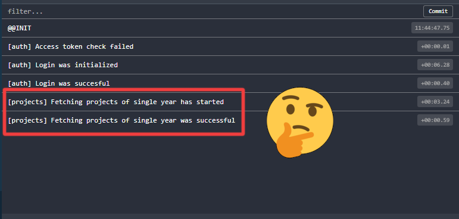
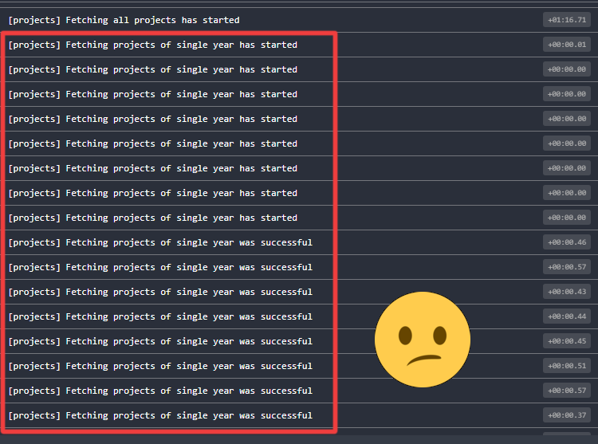
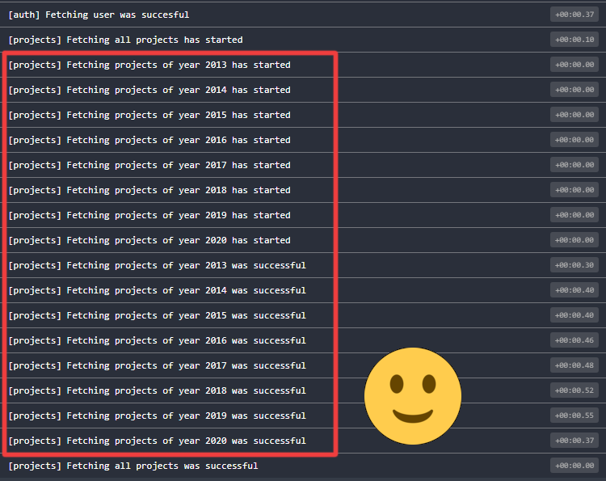

import Note from "@components/Note"

# One dirty redux devtools logging trick

While redux is far from being the coolest kid in the playground at the moment (late 2020), I am still using it on some of my projects. There is still one feature, which most of its competitors (like zustand, jotai, recoil, react-query or SWR) lack so far: mature and feature rich devtools.

<Note>This article is not up-to-date. While the proposed trick is still valid, i can't se any reason to keep using vanilla Redux in 2022. 💡 I would suggest to check <a style={{ all: "unset", textDecoration: "underline", cursor: "pointer" }} href="https://redux-toolkit.js.org/">Redux Toolkit</a>, which yields a much better DX (unfortunately, you can't use the proposed trick here).</Note>

But even on redux-devtools, there was something which makes me think meh… and that thing is logging constants. Even though I made my redux constants (thanks mostly ducks inspiration) much less GENERATED_CODE_LOOKALIKE and more human readable, I'd like to have a possibility to use parametrize them.

```js
// These constants are quite pleasant to read, but they are still, well… constant. 
const FETCH_PROJECTS_OF_SINGLE_YEAR_INITIALIZED = "[projects] Fetching projects of single year has started"
const FETCH_PROJECTS_OF_SINGLE_YEAR_SUCCESS = "[projects] Fetching projects of single year was successful"
const FETCH_PROJECTS_OF_SINGLE_YEAR_FAILURE = "[projects] Fetching projects of single year has failed"
```

On the devtools pane, it looks O.K. – not great, not terrible:



However, if I dispatch a lot of these actions in a row, I can't help to think that something is missing here:



As it turned out, it would be quite easy! Just turn your constants into functions which receives an argument and returns a string utilizing it:

```js
const FETCH_PROJECTS_OF_SINGLE_YEAR_INITIALIZED = year =>
  `[projects] Fetching projects of year ${year} has started`
const FETCH_PROJECTS_OF_SINGLE_YEAR_SUCCESS = year =>
  `[projects] Fetching projects of year ${year} was successful`
const FETCH_PROJECTS_OF_SINGLE_YEAR_FAILURE =  year =>
  `[projects] Fetching projects of year ${year} has failed`
```

Well, O.K. then, but what about actions reducers? No worries! In the case of actions, just make their type property a function call and pass your argument in:

```js
const fetchProjectsOfSingleYearInit = year => ({
  // Note 'type' is a function call
  type: FETCH_PROJECTS_OF_SINGLE_YEAR_INITIALIZED(year),
  year,
})
const fetchProjectsOfSingleYearSuccess = (projectsOfSingleYear, year) => ({
  // Note 'type' is a function call
  type: FETCH_PROJECTS_OF_SINGLE_YEAR_SUCCESS(year),
  projectsOfSingleYear,
  year,
})
const fetchProjectsOfSingleYearFailure = (error, year) => ({
  type: FETCH_PROJECTS_OF_SINGLE_YEAR_FAILURE(year),
  error,
})
```

As for the reducers, there is the same pattern: make your case a function call and pass your argument. It will match as expected:

```js
export default function reducer(state = {}, action = {}) {
  switch (action.type) {
    case FETCH_PROJECTS_OF_SINGLE_YEAR_INITIALIZED(action.year):
      return {
        //...
      };
    case FETCH_PROJECTS_OF_SINGLE_YEAR_SUCCESS(action.year):
      return {
        //...
      };
    case FETCH_PROJECTS_OF_SINGLE_YEAR_FAILURE(action.year):
      return {
        //...
      };
    default:
      return state;
  }
}
```

And voilà, your redux devtools actions console is much more informative (and fun):


I really appreciate this when debugging a lot of actions of the same type being dispatched with different parameters. More than that, it can reveal possible bugs caused by an unexpected argument passes into actions (e. g. react-router params from mistyped url).



The idea about making constants dynamic may sound like a heresy for some hardcore redux developers. I would argue that:

- the pattern is deterministic, using solely pure functions,
- it is meant to be used rather temporarily, for the purpose of debugging.

So far, I did't encounter any issue using it.

👍 Enjoy!